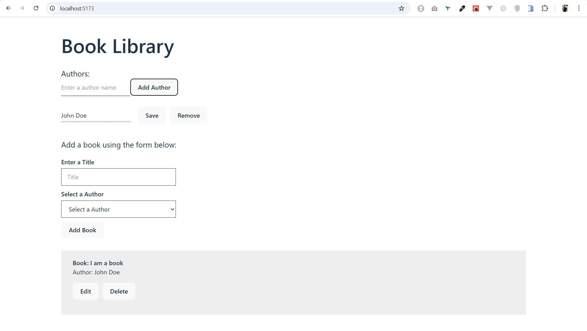

# Book Library API & Frontend



**Book Library** project with a backend API and frontend client.

- **Backend**: Node.js, Express, TypeScript, Prisma, PostgreSQL
- **Frontend**: React, TypeScript, Vite, TailwindCSS
- **Database**: PostgreSQL (via Docker Compose)

---

## Getting Started

### 1. Clone the Repository

```bash
git clone https://github.com/sukhy-ghataore/book-library-api.git
cd book-library-api
```

### 2. Copy `.env` from example

```
cd api
cp .env.example .env
```

### 3. Start Docker PostgreSQL

```
docker-compose up -d
```

## Backend (API)

- Install Dependencies
- Setup Database
- Run Development Server

### Setup

```
cd api
npm install
npm run prisma:generate     # generate Prisma client
npm run prisma:migrate init # apply DB schema
npm run dev                 # runs API on http://localhost:3000
```

## Frontend

- Install Dependencies
- Run Development Server

### Setup

```
cd book-library
npm install
npm run dev               # runs frontend on http://localhost:5173
```
